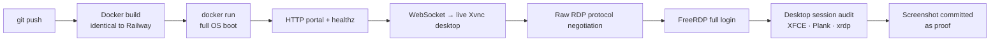

<p align="center">
  
</p>

<h1 align="center">THADD OS</h1>
<p align="center"><em>One OS. All the Best. — a universal Linux desktop that lives in the cloud.</em></p>

<p align="center">
  <a href="https://github.com/ThaddeusHackz/RDP-universal-/actions/workflows/thadd-os-ci.yml"></a>
  
  
  
  
</p>

---

**THADD OS** is a complete, lightweight Linux operating system that runs **forever in the cloud** and is reachable from **anywhere**:

- 🌐 **In any web browser** — a branded portal with an instant, zero-install desktop (noVNC).
- 🖥️ **From any RDP client** — including **Microsoft's own Remote Desktop** (mstsc) on Windows, via a real RDP server (xrdp) on port **3389**, just like a VPS: **IP → username → password**.
- 🪶 **Lightweight like Debian** — Debian 12 base + XFCE: idles around 300 MB of RAM and still runs a full browser session without disappointing.
- 🔁 **Self-healing and forever-on** — healthchecks, auto-restart policies and a persistent Railway volume.
- 🕵️ **CI-verified on every push** — the CI pipeline below *builds the OS, logs into it over real RDP, and photographs the running desktop* before it ships.

It is designed to impress: the first thing you see is a polished, curated desktop — XFCE 4.18 dressed in Arc-Dark, Papirus-Dark icons, Inter typography, a macOS-style Plank dock, a live conky HUD, a Dracula terminal and a starship prompt — branded **THADD OS** down to the kernel's `os-release`.

---

## 📸 Proof it works

Every push to this repo triggers a full end-to-end test that **logs into the running OS over a real RDP connection** and commits a screenshot of the live desktop back to the repo:

<p align="center"></p>

> The screenshot above is machine-captured by the CI workflow (`thadd-os-ci.yml`) — it is not a mock-up.

---

## 🚀 Deploy on Railway (≈5 minutes)

### Step 1 — Create the service

1. Go to [railway.com](https://railway.com) → **New Project** → **Deploy from GitHub repo**.
2. Select this repository (`ThaddeusHackz/RDP-universal-`). Railway auto-detects the `Dockerfile` (`railway.json` pins it explicitly).
3. Railway builds the image (2–4 min) and starts THADD OS.

Or with the CLI:

```bash
railway init
railway up
```

### Step 2 — Set your password (recommended)

In the service → **Variables**, set:

| Variable | Default | Purpose |
|---|---|---|
| `THADD_USER` | `thadd` | Login username (RDP + browser) |
| `THADD_PASSWORD` | `thadd` | Login password (RDP + browser) |
| `THADD_ROOT_PASSWORD` | *(empty)* | Optional root password |
| `RESOLUTION` | `1600x900` | Desktop resolution |
| `SWAP_MB` | `512` | Optional swap file (self-managed, best-effort) |

```bash
railway variables set THADD_PASSWORD='your-strong-password'
```

> ⚠️ If you keep the default password on a public domain, assume it is public. Change it.

### Step 3 — Make it last forever (persistence)

1. Service → **Volumes** → **Add Volume**.
2. Mount it at **`/home/thadd`**.

Your entire desktop profile, files and settings now survive redeploys and restarts. On first boot of a fresh volume, THADD OS automatically seeds the themed desktop into it. Combined with the `ON_FAILURE` restart policy and healthchecks (`/healthz`), the OS effectively **runs forever**.

### Step 4 — Access it

| Path | How |
|---|---|
| **Browser** | Open the service's public domain (e.g. `https://thadd-os-production-xxxx.up.railway.app`) → **Open Desktop in Browser** → enter username/password. |
| **Windows Remote Desktop** | Service → **Settings → Networking → TCP Proxy** → add a proxy for application port **3389**. Railway gives you a public `host:port` (e.g. `roundhouse.proxy.rlwy.net:11105`). Open **mstsc**, type the host, port, username and password. |
| **Any RDP client** | Remmina / FreeRDP / Jump Desktop / Parallels Client — same host, port `3389`, username + password. |
| **CLI (TCP proxy)** | `railway tcp-proxy create --port 3389` |

> Note: the TCP proxy requires a paid Railway plan (Hobby and above). The browser access works on any plan.

Inside the OS, `RAILWAY_TCP_PROXY_DOMAIN` / `RAILWAY_TCP_PROXY_PORT` are exposed automatically, and the boot log prints your exact connection string.

---

## 🔐 Default credentials

| Field | Value |
|---|---|
| Username | `thadd` |
| Password | `thadd` (change via `THADD_PASSWORD`!) |
| Sudo | passwordless (`sudo`) |
| RDP port | `3389` |
| Web port | Railway's `PORT` |

---

## ✨ What's inside

**The "best of all Linux" lineup** — see [`docs/BEST_OF_LINUX.md`](docs/BEST_OF_LINUX.md) for the full lineage:

| Heritage | What THADD OS takes |
|---|---|
| **Debian** | The base: stability, apt, and lightness — the foundation |
| **Ubuntu / Xubuntu** | Usability DNA: XFCE desktop, batteries-included experience |
| **elementary OS** | The Plank dock and the "less but better" aesthetic |
| **Arch** | The minimalism philosophy and ricing culture: starship, btop, neofetch |
| **Fedora** | Modern desktop standards: latest XFCE, PipeWire-era plumbing via Debian |
| **r/unixporn** | Arc-Dark + Papirus-Dark + Dracula terminal + conky HUD |

**The stack**

- **Base:** Debian 12 (bookworm-slim)
- **Desktop:** XFCE 4.18 + whisker menu + Arc-Dark + Papirus-Dark + Inter + JetBrains Mono
- **RDP:** xrdp (Microsoft Remote Desktop compatible, TLS/NLA negotiation)
- **Browser desktop:** TigerVNC (Xvnc) + websockify + noVNC, persistent always-on session
- **Edge:** nginx portal with `/healthz`, `/api/creds`, WebSocket bridge
- **Orchestration:** supervisord — every service auto-restarts forever
- **Apps:** Firefox ESR, Thunar, Mousepad, Ristretto, btop, neofetch, htop, git, sudo, bat, duf…
- **Extras:** custom `thadd` CLI, `thadd doctor` diagnostics, first-boot welcome terminal, custom MOTD, THADD-branded `os-release` (so `neofetch` says **THADD OS**)

## 🩺 Using the OS

```bash
thadd            # system overview with the THADD banner
thadd doctor     # full self-diagnostic of every service
thadd welcome    # welcome banner
neofetch         # system info with the THADD logo
btop             # gorgeous live resource monitor
```

## 🧪 How it is tested



Run the same suite anywhere with Docker:

```bash
docker build -t thadd-os .
docker run -d --name thadd -p 8080:8080 -p 3389:3389 \
  -e PORT=8080 -e THADD_PASSWORD='Test123!' -e RESOLUTION=1280x800 thadd-os
# portal: http://localhost:8080   ·   RDP: localhost:3389
```

## 📚 Documentation

- [`docs/BEST_OF_LINUX.md`](docs/BEST_OF_LINUX.md) — the design manifesto: which distro contributed what
- [`docs/ARCHITECTURE.md`](docs/ARCHITECTURE.md) — ports, services, sessions, security and performance tuning
- [`FORENSIC_SCAN.md`](FORENSIC_SCAN.md) — the forensic audit of the legacy repository
- [`scripts/forensic-scan.sh`](scripts/forensic-scan.sh) — the reusable forensic scanner

## ❓ FAQ

**Does it really run forever?** Railway keeps the container running 24/7 (it never sleeps), healthchecks detect faults, `restartPolicyType: ON_FAILURE` + supervisord restart any component that dies, and your data lives on a volume that outlives every container.

**How heavy is it?** Idle ≈ 300 MB RAM. Firefox browsing ≈ 600–800 MB. A Railway 1 GB plan is plenty; 512 MB works for light use. Tuning knobs in `docs/ARCHITECTURE.md`.

**Can I really use Windows' own Remote Desktop app?** Yes — mstsc connects to the TCP-proxy host:port with the username/password. The CI pipeline proves this exact path with FreeRDP on every push.

**Is the connection secure?** RDP runs xrdp with TLS (`crypt_level=high`, NLA negotiation); the browser path is HTTPS on Railway's edge and the VNC socket is localhost-only inside the container, bridged through a password-authenticated RFB session. The password is yours to strengthen via variables.

---

<p align="center">Built with ❤️ and a lot of Debian — <strong>THADD OS 1.0 (Nebula)</strong></p>
